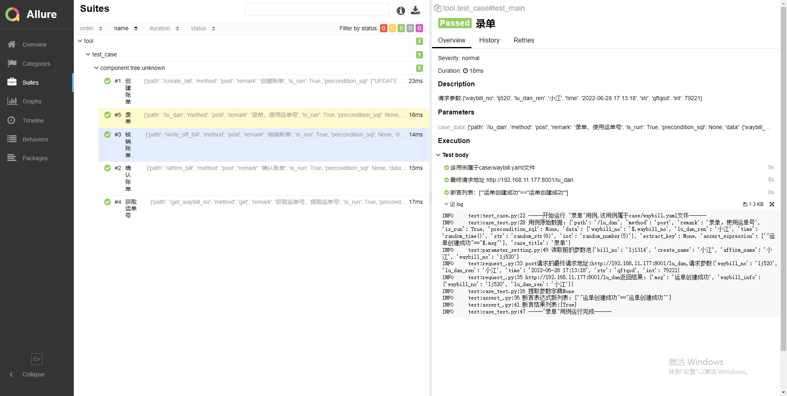

# pytest_api_yaml

#### 介绍
'''
基于pytest+yaml+allure+requests搭建的接口自动化框架(提供测试接口基于fastapi)
    1、每条用例前置sql，请求参数sql，断言sql
    2、requests二次封装，自动获取ip和header信息
    3、allure动态方法封装（标题、描述、步骤）
    4、钉钉机器人发生allure报告公司局域网内可以访问
    5、log日志记录每个重要参数
    6、多接口参数依赖（接口返回提取，请求使用）
    7、token信息全局前置写入配置文件
    8、用例文件支持多目录多文件运行，支持排除目录或者文件
    9、定位运行的用例属于哪个文件
    10、支持随机几位数字或者字符串
    11、提供mock接口
    12、多环境测试（需要配置要测试的环境名和不同环境token）
    13、用例标题重复停止测试
    14、支持多个断言条件
    15、接口请求参数替换支持list:  [$.waybillid] ,一层json: {'c':$.c}  ,多层json: {'a':'a','c':[{'c1':^$.c1^},{'time':^random_time()^}]
'''

#### 框架教程搭建
https://blog.csdn.net/aaaaaaaaanjjj/article/details/125274053
#### 框架环境配置和使用教程
https://blog.csdn.net/aaaaaaaaanjjj/article/details/125848419
#### 框架搭建视频视频
https://www.bilibili.com/video/BV1vU4y1S7oG
#### 微信群
d

#### 安装教程

下载依赖requirements.txt
环境安装和启动的坑
 1.pip install allure-pytest 这个也使用2.8版本
 2.windows安装allure 和系统变量配置（还需要配置jdk）（我这个allure是2.8），如果pycharm打开项目后配置的allure路径，一定要重启pycharm
 3.日志文件位置，改为当前项目日志文件夹的绝对路径
 4.mock接口的地址，要改成当前mock接口地址

#### 使用说明
我配置config.py文件里的数据库域名是错误的，使用自己的数据库，设置用例里面的sql
先启动 pytest_test_api.py mock接口
启动框架   run_test.py

#### 参与贡献

1.  Fork 本仓库
2.  新建 Feat_xxx 分支
3.  提交代码
4.  新建 Pull Request

#### 报告截图

