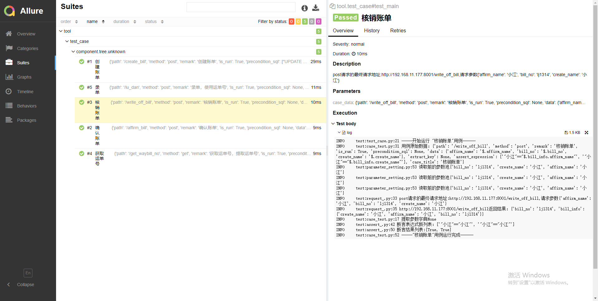

# pytest_api_yaml

#### 介绍
'''
基于pytest+yaml+allure+requests搭建的接口自动化框架(提供测试接口基于fastapi)
tool功能：
	__init__: 读取具体的环境配置信息给requests_使用
	requests_请求接口：requests二次封装,自动获取headers和域名信息
	read_file文件读取：读取目录下yaml文件，支持排除指定文件和目录，最终返回字典格式的用例数据
	parameter_setting参数设置：提供参数池，支持接口返回参数提取保存和接口请求参数提取（解决参数依赖）
	log日志：保存运行日志记录
	function函数：支持随机几位数的字符，数字和当前时间函数，直接在用例文件中使用
	assert_断言操作：处理多个断言表达式，返回最终断言结果
	case_test用例执行:处理从read_file读取出的原始用例数据，使用parameter_setting进行参数存储和提取，使用assert_进行断言，最后返回用例执行结果
	allure_报告定制:allure.dynamic动态属性的简单封装
	mysql_：数据库操作，用于前置sql，请求参数sql，断言sql
'''

#### 安装教程

下载依赖requirements.txt

#### 使用说明
我配置config.py文件里的数据库域名是错误的，使用自己的数据库，设置用例里面的sql
先启动 pytest_test_api.py mock接口
启动框架   run_test.py

#### 参与贡献

1.  Fork 本仓库
2.  新建 Feat_xxx 分支
3.  提交代码
4.  新建 Pull Request

#### 报告截图

